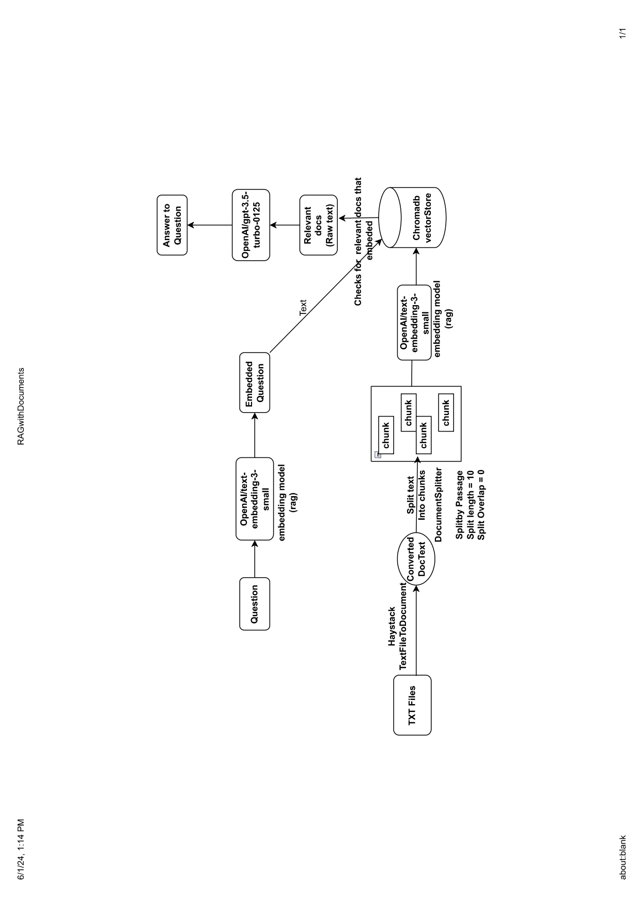

# RAG_application-Haystack
- [ ] I have use Haystack framework for building RAG application . Chromadb + OpenAI

  

### Start with 
pip install -r requirements.txt

### constant.py
- [ ] API_KEY = "sk-xxxxxxxxxxxxxxxxxxxxxxxxxxxxxxxxxxxx" (paste your OpenAI key here)
- [ ] llm = "gpt-3.5-turbo-0125" (OpenAI model you want to use)
- [ ] embedModel = "text-embedding-3-small" (embedding model)
- [ ] template = """ 
-- You are a helpful assistant. Always follow <<Context:>>
-- Please answer the <<Question:>> user asked accordingly. Don't try to generate random answer.

Context:

    {{ document.content }}


Question: {{question}}
Answer:
""" (Prompt template)

- [ ] DB_FOLDER = 'DB' (ChromaDB location)
